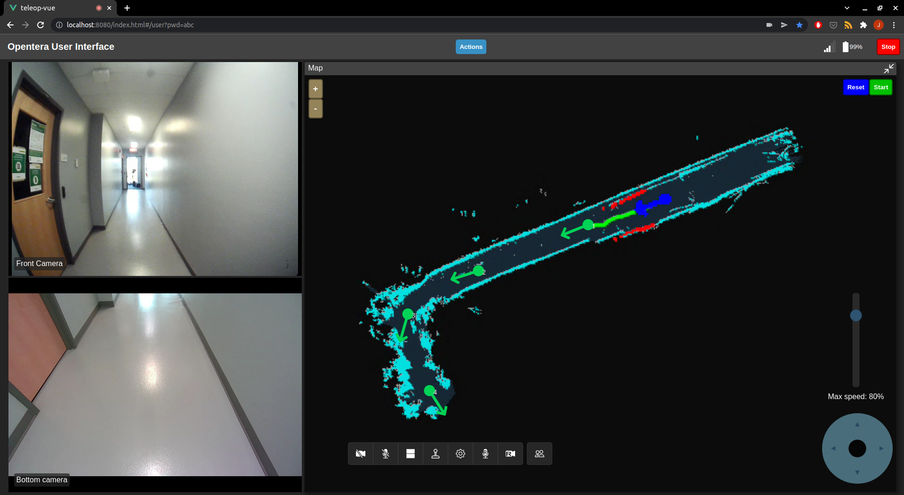

# opentera-webrtc-teleop-frontend

An OpenTera web user interface to teleoperate a robot. Made with Vue.js 3.

## Authors

- Gabriel Lauzier (@G-Lauz)
- Marc-Antoine Maheux (@mamaheux)
- Jérémie Bourque (@JeremieBourque1)
- Dominic Létourneau (@doumdi)
- Philippe Warren (@philippewarren)

## Features

- Dual camera view
- Virtual joystick to move the robot
- Use the arrow keys to move the robot
- A slider to limit the maximum speed
- Battery and wifi signal indicators
- A draggable and expandable map widget which can be zoomed and panned with the mouse wheel or touch gestures
- Ability to place waypoints on the map that the robot can navigate to autonomously
- Autonomous docking
- Option to toggle between the mapping and localization modes.

## Demo

The easiest way to try out the interface is to use the Gazebo demo in [opentera-webrtc-ros](https://github.com/introlab/opentera-webrtc-ros). You can find the instructions on how to run the demo [here](https://github.com/introlab/opentera-webrtc-ros/blob/main/opentera_webrtc_demos/README.md)

## Related projects

- [opentera](https://github.com/introlab/opentera)
- [opentera-webrtc](https://github.com/introlab/opentera-webrtc)
- [opentera-webrtc-ros](https://github.com/introlab/opentera-webrtc-ros)
- [opentera-teleop-service](https://github.com/introlab/opentera-teleop-service)

## License

- [Apache License, Version 2.0](LICENSE)

## Sponsor

[IntRoLab - Intelligent / Interactive / Integrated / Interdisciplinary Robot Lab](https://introlab.3it.usherbrooke.ca)
